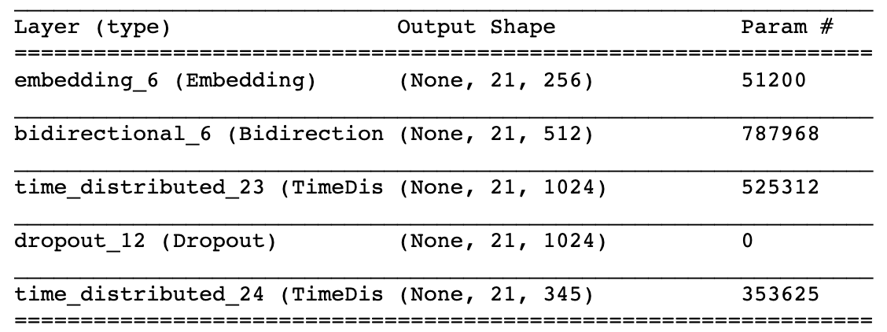
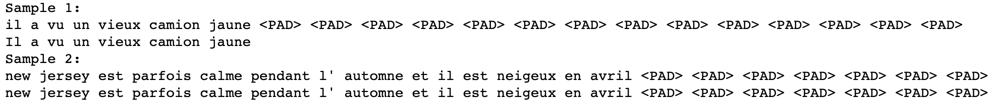

# NLP Machine Translation

In this project, we will build a deep neural network that functions as part of an end-to-end machine translation pipeline. Our completed pipeline will accept English text as input and return the French translation.

### Overview

Preprocess - We'll convert text to sequence of integers.
Models - Create models which accepts a sequence of integers as input and returns a probability distribution over possible translations. After learning about the basic types of neural networks that are often used for machine translation, we'll engage in our own investigations, to design our own model!
Prediction - Run the model on English text.

## Packages

This project uses keras to build the RNN translation models.

## Credit

This was part of Udacity's Natural Language Processing Nanodegree.

## Files

The main file is **machine_translation.ipynb**, which first creates the RNN models using Keras.

## Results

The final model used embeddings and bidirectional GRUs.

Here are two examples of the model's predictions. For each example, the first line is the prediction followed by expected output on the second line.

